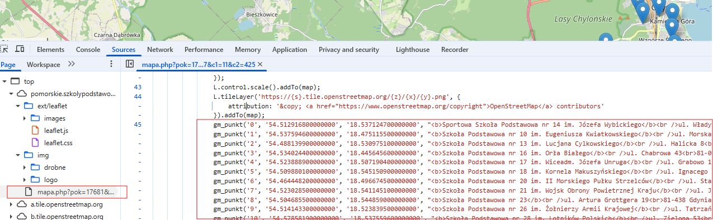

# PolishPrimarySchoolsData

The project is a set of Java-based mini-apps designed to prepare primary school rankings data across Poland. 
It provides nationwide rankings for the years 2022–2025 and major city rankings for 2020–2021, 
sourced from waszaedukacja.pl (calculated ranking) and from edubaza.pl (geographic data). 

Rankings for 2025, 2024, 2023, 2022 are available for the whole of Poland.
Rankings for 2021, 2020 are available only for big cities by URLs:
https://waszaedukacja.pl/ranking/{city}/szkoly-podstawowe/2021
https://waszaedukacja.pl/ranking/{city}/szkoly-podstawowe/2020
e.g.
https://waszaedukacja.pl/ranking/warszawa/szkoly-podstawowe/2020

## To add a new city - use CreateSchoolRatings.
You will need
1. Save the web page with ratings for the city, that is available at https://waszaedukacja.pl/ranking/{city}/szkoly-podstawowe, to a file 
   {project}\src\main\resources\html\{city}\Ranking Szkół Podstawowych {city} {year}.html
2. Download .js file for the {city} with GEO data. For this go to https://szkolypodstawowe.edubaza.pl, select your state(województwo), then city and "all schools" ("wszystkie"), then click map link on the right.
   Then press F12, find the javascript code with gm_punkt() function calls and copy all of them to {project}\src\main\resources\js\script_with_geo_{city}.js.
   
3. Update 2 variables at the very first lines of CreateSchoolRatings.main() to the {city} and current year accordingly 
4. Run CreateSchoolRatings. The result will be printed to console. Copy json from console to {project}\src\main\resources\json\{city}\schools.json for future use in UI.
   

Let's add Gdynia as an example.
1. Save https://waszaedukacja.pl/ranking/gdynia/szkoly-podstawowe to "{project}\src\main\resources\html\gdynia\Ranking Szkół Podstawowych Gdynia 2025.html"
2. Go to https://szkolypodstawowe.edubaza.pl, select Pomorskie województwo, Gdynia, wszystkie in a filter anc click map link on the right. 
   Then press F12, find the javascript code with gm_punkt() function calls and copy all of them to {project}\src\main\resources\js\script_with_geo_gdynia.js
3. Update variables in CreateSchoolRatings.main() to
     var city = "Gdynia";
     var year = 2025;
4. Run CreateSchoolRatings and copy json from console to {project}\src\main\resources\json\Gdynia\schools.json


## What to do with schools having rating but without GEO data?
1. You have to find GEO coordinates yourself manually (e.g. in google maps) and put them into {project}\src\main\resources\json\snippet.json like:
```
[
  {
    "name": "Szkoła Podstawowa nr 44 im. Obrońców Wybrzeża Gdynia",
    "latitude": 54.55818094927507,
    "longitude": 18.50532398007456
  },
  {
    "name": "Szkoła Podstawowa nr 48 Gdynia",
    "latitude": 54.50141021642098,
    "longitude": 18.452742513955894
  }
]
```
2. Run UpdateSchoolRatingForSnippet. The result will be printed to console. 
3. Merge data from result json with existing {project}\src\main\resources\json\{city}\schools.json for future use in UI.


## To update existing city rating - run UpdateSchoolRating.